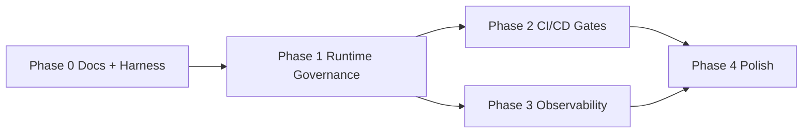

# Agentic Governance — Phased Implementation Plan

**Goal:** Establish thought leadership with a production-quality reference architecture — not a LangChain demo.

**Principle:** Ship governance value in every phase. Each phase must be demoable, documented, and CI-gated.

---

## Naming rationale

| Candidate | Verdict |
|-----------|---------|
| `enterprise-agent-governance` | Accurate but long; reads like internal Humana doc |
| `ai-governance-reference` | Too generic; SEO collision |
| `langgraph-healthcare-demo` | Wrong framing — LangGraph is implementation detail |
| **`agentic-governance`** | **Selected** — category-defining, short, pairs with `semantic-harness` |

**Full title:** Enterprise Agentic AI SDLC Reference Architecture  
**Subtitle on README:** Operationalizing Semantic Harness for production

---

## Phase 0 — Foundation & thought leadership (Week 1–2)

**Outcome:** Repo exists, narrative is clear, harness declares the healthcare agent, docs establish the category.

| Deliverable | Path | Done when |
|-------------|------|-----------|
| README with CI/CD star diagram | `README.md` | Architect recognizes SDLC pattern in 30s |
| Governance layers explainer | `docs/GOVERNANCE-LAYERS.md` | Covers compliance + agentic + SDLC |
| AI SDLC spec | `docs/AI-SDLC.md` | Every gate named with fail criteria |
| Runtime architecture | `docs/RUNTIME-GOVERNANCE.md` | Middleware chain documented |
| Semantic Harness bridge | `docs/SEMANTIC-HARNESS-BRIDGE.md` | `sh:Invariant` → CI probe mapping |
| Healthcare agent harness | `harness/harness.jsonld` | Validates with `harness validate` |
| Synthetic data spec | `docs/SYNTHETIC-DATA.md` | Zero real PHI; faker schema documented |
| Directory skeleton + package scaffold | `pyproject.toml`, `Makefile` | `uv sync` works |
| LICENSE (Apache 2.0) | `LICENSE` | Matches semantic-harness |

**Exit criteria:**
- [ ] `harness validate harness/harness.jsonld` passes
- [ ] Docs readable as standalone architecture brief (no code required)
- [ ] GitHub repo public with clear positioning

**Thought leadership artifact:** Blog post / LinkedIn — *"Governance is not a component. It's the CI/CD pipeline."*

---

## Phase 1 — Governance core + minimal agent (Week 3–5)

**Outcome:** Healthcare appointment assistant runs locally with runtime governance middleware. LangGraph exists but is not the story.

| Deliverable | Path | Done when |
|-------------|------|-----------|
| Policy engine | `governance/policy_engine.py` | Loads rules from harness + YAML |
| Authorization (RBAC) | `governance/authorization.py` | User role gates retrieval scope |
| Tool permissions | `governance/authorization.py` | Planner cannot call denied tools |
| Output guardrails | `governance/output_guardrails.py` | PHI regex + block/audit |
| Audit logger | `governance/audit.py` | Structured JSON logs, who/what/why |
| Quality gate runner (local) | `governance/quality_gates.py` | Invoked by Makefile `make gate` |
| Synthetic patient DB | `knowledge/documents/synthetic/` | 50 fake patients, JSON |
| pgvector RAG (minimal) | `knowledge/rag/retriever.py` | Retrieval scoped by authorization |
| LangGraph agent | `agent/graph.py` | Planner + retrieval + scheduling tools |
| FastAPI + middleware chain | `api/main.py` | Full runtime governance chain |
| Unit tests | `tests/unit/` | Policy engine, auth, guardrails |
| Docker Compose (API + Postgres) | `docker-compose.yml` | `make dev-up` works |

**Exit criteria:**
- [ ] `curl` appointment question returns grounded answer with citation
- [ ] `curl` "Show me John's MRI" as unauthorized user → 403 + audit event
- [ ] `make test` green
- [ ] No real PHI anywhere (static scan enforced)

**Demo script:** 5-minute walkthrough of runtime middleware blocking unauthorized PHI access.

---

## Phase 2 — Evaluation framework + CI gates (Week 6–8)

**Outcome:** Every PR runs the AI SDLC pipeline. Pipeline fails when governance thresholds violated.

| Deliverable | Path | Done when |
|-------------|------|-----------|
| Eval runner framework | `evaluation/runner.py` | Machine-readable JSON reports |
| Hallucination suite | `evaluation/hallucination/` | No-context → refusal expected |
| PHI leakage suite | `evaluation/phi/` | 20+ unauthorized access scenarios |
| Grounding suite | `evaluation/grounding/` | Citation coverage ≥ threshold |
| Prompt regression | `evaluation/prompt_regression/` | Golden prompts + accuracy floor |
| Latency benchmarks | `evaluation/latency/` | p95 < 2s |
| Cost budget | `evaluation/latency/cost.py` | avg tokens < 5000 |
| GitHub Actions workflow | `.github/workflows/ai-sdlc.yml` | Full gate chain on PR |
| Architecture validation job | CI step | `harness validate` + invariant probe |
| Security scan job | CI step | bandit + pip-audit |
| Pre-commit hooks | `.pre-commit-config.yaml` | ruff, mypy, PHI static scan |
| Integration tests | `tests/integration/` | End-to-end API + eval |

**Exit criteria:**
- [ ] PR that degrades prompt accuracy → CI fails
- [ ] PR that removes authorization check → PHI test fails
- [ ] `evaluation/reports/` produces JSON artifact uploadable to PR comment
- [ ] README diagram matches actual workflow YAML

**Thought leadership artifact:** *"The AI SDLC pipeline" — Mermaid + GitHub Actions screenshot*

---

## Phase 3 — Observability + production posture (Week 9–10)

**Outcome:** Running agent exposes enterprise metrics. Grafana dashboard tells the governance story.

| Deliverable | Path | Done when |
|-------------|------|-----------|
| Prometheus metrics | `observability/metrics.py` | All metrics from README list |
| OpenTelemetry tracing | `observability/tracing.py` | Request → planner → tool spans |
| Grafana dashboard | `observability/grafana/dashboards/` | Goal success, PHI blocks, latency, cost |
| Docker Compose observability | `docker-compose.yml` | Prometheus + Grafana profiles |
| Alerting rules (example) | `observability/prometheus/alerts.yml` | PHI violation spike alert |
| Runbook | `docs/RUNBOOK.md` | On-call playbook for blocked responses |

**Metrics exposed:**

| Metric | Type |
|--------|------|
| `agent_goal_success_rate` | Gauge |
| `agent_hallucination_rate` | Gauge |
| `agent_phi_violations_total` | Counter |
| `agent_tool_errors_total` | Counter |
| `agent_request_latency_seconds` | Histogram |
| `agent_llm_tokens_total` | Counter |
| `agent_human_escalations_total` | Counter |
| `agent_governance_blocks_total` | Counter |

**Exit criteria:**
- [ ] Grafana dashboard loads with synthetic traffic
- [ ] Blocked PHI attempt increments `agent_phi_violations_total`
- [ ] `docs/OBSERVABILITY.md` explains each metric's governance meaning

---

## Phase 4 — Thought leadership polish (Week 11–12)

**Outcome:** Repo is interview-ready, conference-ready, and Semantic Harness ecosystem reference.

| Deliverable | Path | Done when |
|-------------|------|-----------|
| Architecture diagrams (Mermaid) | `docs/ARCHITECTURE.md` | Runtime + SDLC + data flow |
| Interview guide | `docs/INTERVIEW-GUIDE.md` | "Where does governance live?" answered |
| Comparison matrix | `docs/COMPARISON.md` | vs LangSmith-only, vs bare LangGraph |
| `harness verify` integration | `harness/harness.jsonld` probes | CI runs `harness verify` |
| Multi-agent expansion (optional) | `agent/graph.py` | Planner + Research + Retrieval + Eval agents |
| Approval workflow stub | `governance/approval.py` | Human-in-loop gate for high-risk |
| Contributing guide | `CONTRIBUTING.md` | How to add eval suites |
| Talk deck outline | `docs/TALK-OUTLINE.md` | 20-slide structure |

**Exit criteria:**
- [ ] External architect can clone, read docs only, and explain governance model
- [ ] Listed on semantic-harness.org as reference implementation
- [ ] One recorded demo video script in `docs/DEMO-SCRIPT.md`

---

## Dependency graph

Phases 2 and 3 can partially overlap after Phase 1 completes.

---

## Technology stack (locked)

| Layer | Choice | Why |
|-------|--------|-----|
| Language | Python 3.12 | Enterprise AI standard |
| Package manager | UV | Fast, modern |
| Agent runtime | LangGraph | Implementation detail; swappable |
| API | FastAPI | Middleware chain, OpenAPI |
| Vector store | PostgreSQL + pgvector | Simple ops, no extra vendor |
| Graph DB | Neo4j (optional, Phase 4) | Knowledge graph extension |
| LLM | OpenAI-compatible interface | BYOK / Azure OpenAI ready |
| CI | GitHub Actions | Star of the repo |
| Metrics | Prometheus + Grafana | Enterprise recognition |
| Tracing | OpenTelemetry | Standard |
| Lint | Ruff + mypy | Fast CI |
| Test | Pytest | Standard |
| Declaration | Semantic Harness JSON-LD | Thought leadership bridge |

---

## What we explicitly will NOT build

- Real patient data or HIPAA-covered production system
- Full EHR integration
- Custom LLM training
- Another agent framework
- Semantic UI / Closure Apps coupling (keep focused)
- Giant application UI — API + Grafana only

---

## Success metrics (for the repo itself)

| Metric | Target (6 months post-launch) |
|--------|-------------------------------|
| GitHub stars | 500+ (niche reference arch) |
| `harness validate` adopters | 10+ forks with custom harness |
| Conference / blog citations | 3+ external references |
| CI gate pattern copies | Measured by fork workflow diffs |
| Interview usage | Anecdotal — "I used agentic-governance in my portfolio" |

---

## Immediate next actions (Phase 0 completion)

1. Finish `harness/harness.jsonld` with healthcare agent + invariants + metric probes
2. Add `pyproject.toml` with uv, ruff, pytest skeleton
3. Add `Makefile` with `validate-harness`, `lint`, `test` targets
4. Publish Phase 0 docs
5. Open GitHub repo
