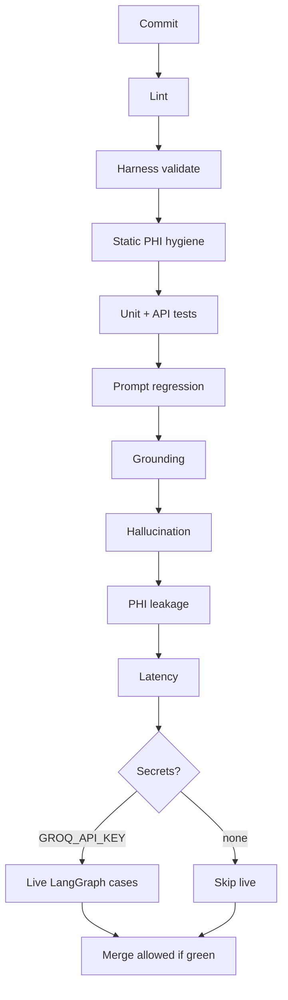

# AI SDLC — Quality Gates

The CI pipeline is a core artifact of this repository. This doc distinguishes **shipped gates** (fail the build today) from **planned gates** (roadmap only).

Living tracker: [PLAN.md](../PLAN.md).

---

## Shipped pipeline (`.github/workflows/ci.yml`)

| Gate | Command | Pass criteria |
|------|---------|---------------|
| Lint | `make lint` | ruff clean, or `compileall` |
| Harness validate | `python scripts/validate_harness.py` | Required types + refs resolve |
| PHI hygiene | `python scripts/static_phi_hygiene.py` | No SSN-like / non-SYN MRN in fixtures |
| Unit + API | `pytest tests/ -q` | 100% pass |
| Prompt regression | `python evaluation/prompt_regression.py` | Golden prompts match status/blocked/citations |
| Grounding | `python evaluation/grounding.py` | Citations present when expected |
| Hallucination | `python evaluation/hallucination.py` | Refusal when no context |
| PHI leakage | `python evaluation/phi.py` | All scenarios match expect_blocked |
| Latency | `python evaluation/latency.py` | Rules-path p95 under budget |
| Claims vertical | `python evaluation/claims_regression.py` | Second vertical envelope holds |
| Live LangGraph | `python scripts/live_graph_cases.py` | Optional — needs repo secret |

Eval gates use **`AGENT_MODE=rules`** (deterministic, no LLM spend). Live job exercises the real LangGraph workflow.

Golden set: `evaluation/baselines/golden.jsonl` — add a line when you add a capability that must not regress.

---

## Planned gates (not in CI yet)

| Gate | Intent |
|------|--------|
| Token cost budget | Avg tokens under threshold (needs live metering) |
| Security scan | bandit + pip-audit |
| Full `harness verify` | Sibling semantic-runtimes HDD probes |
| Coverage floor | pytest-cov on `governance/` |

---

## Rule

Any **shipped** gate failure blocks merge. Waivers require an explicit note — do not silently skip.
