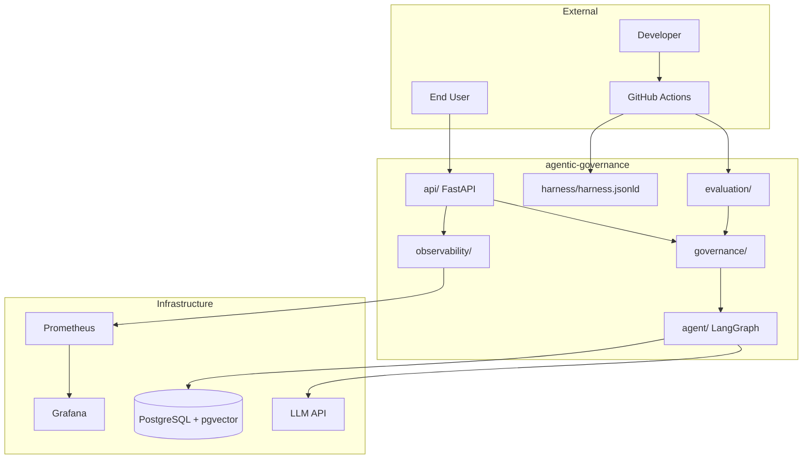

# Architecture

Enterprise Agentic AI SDLC Reference Architecture — system view.

---

## System context

---

## Layered architecture

| Layer | Responsibility | Technology |
|-------|----------------|------------|
| **Declaration** | What the agent is allowed to do | Semantic Harness JSON-LD |
| **Governance** | Enforce policies at runtime + CI | Python middleware |
| **Orchestration** | Plan, retrieve, act | LangGraph (swappable) |
| **Knowledge** | Synthetic RAG | pgvector |
| **Evaluation** | Prove trust before deploy | Pytest + eval runners |
| **Delivery** | AI SDLC pipeline | GitHub Actions |
| **Observability** | Prove trust in production | Prometheus + Grafana |

---

## Data flow — authorized question

1. User authenticates → role `patient`, scope `patient:alice`
2. Authorization middleware attaches scope to request context
3. Planner decides retrieval needed
4. `retrieve_records` called with scope filter → only Alice's synthetic records returned
5. Planner drafts answer with citations
6. Grounding Evaluator approves
7. Output guardrails scan → clean
8. Audit log written → response returned

## Data flow — unauthorized PHI attempt

1. User `patient:alice` asks "Show me John Smith's MRI"
2. Authorization denies cross-patient access at retrieval
3. No records returned to LLM
4. If planner hallucinates anyway, output guardrail blocks
5. Audit event `governance.block` with reason
6. 403 or safe refusal returned
7. `agent_phi_violations_total` incremented

---

## CI/CD integration

See [AI-SDLC.md](./AI-SDLC.md) for gate specifications.

Harness validation runs in CI **before** deploy — architecture and behavior stay linked.

---

## Extension points

| Extension | Phase |
|-----------|-------|
| Neo4j knowledge graph | 4 |
| Human approval workflow | 4 |
| Azure OpenAI / enterprise IdP | 2+ |
| Custom eval verticals (insurance, finance) | Community |
