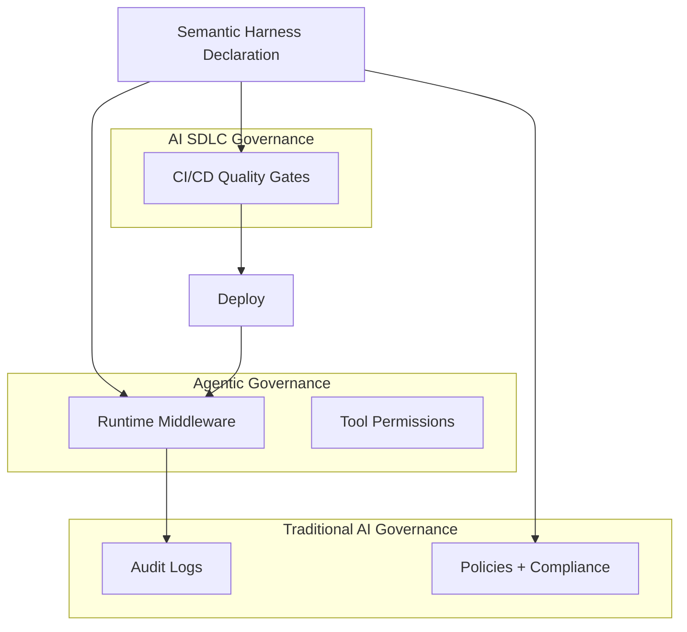

# Governance Layers

Enterprise AI governance is not one thing. This repo implements **three layers** that mature organizations combine.

---

## 1. Traditional AI Governance (compliance & risk)

**Focus:** Policies, responsible AI, security, auditability, regulatory compliance.

| Control | Implementation |
|---------|----------------|
| Who can deploy models? | CI approval gate + environment promotion |
| Are prompts versioned? | `evaluation/prompt_regression/` golden set |
| Are we leaking PHI? | Static scan + eval suite + runtime guardrails |
| Are outputs explainable? | Grounding tests require citations |
| Are we logging everything? | `governance/audit.py` structured audit chain |
| HIPAA alignment | Synthetic data only; architecture demonstrates controls |

```
Policies → Development → Deployment → Monitoring → Audit
```

**Interview answer:** *"Compliance governance ensures we only deploy agents that meet policy — and that we can prove what they did afterward."*

---

## 2. Agentic Governance (runtime autonomy control)

**Focus:** Permissions, tool access, agent coordination, autonomy tiers — governing **behavior**, not just people.

| Control | Implementation |
|---------|----------------|
| Which tools may this agent invoke? | `governance/authorization.py` tool allowlist |
| Which records can retrieval return? | Auth **before** RAG — LLM never sees unauthorized PHI |
| How much autonomy? | Harness `sh:Policy` + `autonomyTier` L0/L1/L2 |
| What requires human approval? | `governance/approval.py` high-risk gate |
| Can agents call each other? | Explicit mesh allowlist (future: Semantic Harness workflow) |

Example policy:

```
Healthcare Planner Agent
  ✓ Read appointment calendar (scoped)
  ✓ Search authorized patient records
  ✓ Summarize visit notes (authorized)
  ✗ Access other patients' imaging
  ✗ Modify billing records
  ✗ Send external communications without approval
```

**Interview answer:** *"Agentic governance controls what autonomous systems can do — independent of which human triggered the request."*

---

## 3. AI SDLC Governance (engineering discipline)

**Focus:** Industrialize AI the way DevOps industrialized software — **quality gates in CI/CD**.

```
Developer → Commit → Build → Unit Tests
    → Prompt Regression → RAG Eval → Hallucination Tests
    → PHI Tests → Latency → Cost → Security → Architecture Validation
    → Approval → Deploy → Monitor → Feedback Loop
```

| Gate | Fail criteria |
|------|---------------|
| Prompt regression | Accuracy drops below baseline |
| Grounding | Citation coverage < threshold |
| Hallucination | Answers without context when should refuse |
| PHI leakage | Unauthorized access not blocked |
| Latency | p95 > 2 seconds |
| Cost | Average tokens > 5000 |
| Architecture | `harness validate` fails or invariant probe red |

**Interview answer:** *"SDLC governance means no prompt change reaches production without passing the same rigor we expect from code."*

---

## How the three layers interact



---

## Where governance lives (concise interview answer)

> "I view governance as a cross-cutting capability, not a single service. At design time, Semantic Harness declares capabilities, invariants, and metrics. During development, CI/CD enforces quality gates — evaluations, PHI tests, regression, latency, and cost budgets. In production, runtime middleware enforces authorization, tool permissions, output validation, and audit logging. In healthcare, governance isn't just compliance — it's the operational discipline that makes agentic systems reliable and trustworthy."

---

## Semantic Harness mapping

| Governance layer | Harness object |
|------------------|----------------|
| Agentic | `sh:Policy`, `sh:Tool`, `sh:Agent` |
| SDLC | `sh:Metric` + `sh:probe`, `sh:Invariant`, `sh:Goal` |
| Traditional | `sh:Invariant` (blocking), audit events |

See [SEMANTIC-HARNESS-BRIDGE.md](./SEMANTIC-HARNESS-BRIDGE.md).
