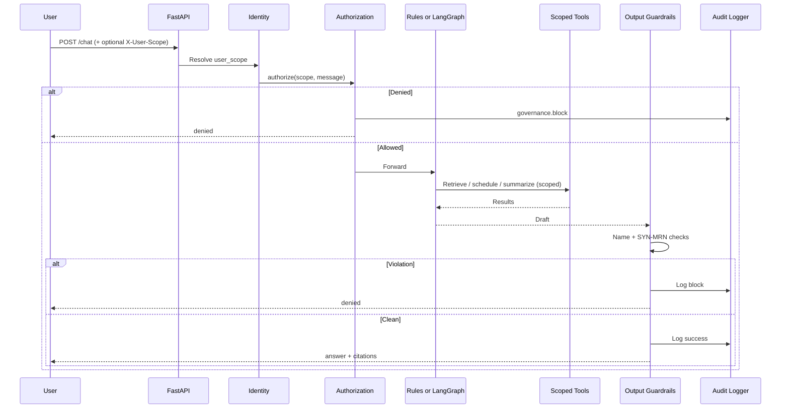

# Runtime Governance Architecture

Every request passes through a governance envelope before and after the planner (rules or LangGraph).

---

## Request flow

---

## Identity (demo-grade)

| Mode | Behavior |
|------|----------|
| Default | `X-User-Scope` if present (must match body if both set); else body `user_scope` |
| `AUTH_STRICT=1` | Header **required**; body cannot disagree |

This is **not** JWT/OIDC. It demonstrates “identity before tools” without pretending to ship an IdP. Enterprise adopters plug their IdP and map claims → `user_scope`.

---

## Authorization

**Critical principle:** The LLM does not decide who can see PHI.

`governance/authorization.py` runs **before** retrieval and before LangGraph routing. Cross-patient name / id references are denied for the synthetic Alice/John matrix.

---

## Tool permissions

Allowlist = agent `sh:hasTool` ∩ `sh:Policy` allowlist (`harness_loader.allowed_tools_for_agent`).  
Patient id is injected via `contextvars` — the model cannot pass a free-form patient id into tools.

---

## Output guardrails

`governance/output_guardrails.py` blocks other-patient names and `SYN-MRN-*` digits outside the caller’s scope.

---

## Audit

In-memory ring for `/audit`, plus optional JSONL via `AUDIT_LOG_PATH` (default `data/audit.jsonl`; use `off` in CI).

---

## Dual engines

| Mode | Engine |
|------|--------|
| `rules` | Deterministic planner — CI / evals |
| `graph` | Multi-agent LangGraph — live demos |
| `auto` | Graph if LLM key present |

Same authorize → guardrails → audit envelope in both modes.

See [LOCAL.md](./LOCAL.md) and [PLAN.md](../PLAN.md).
