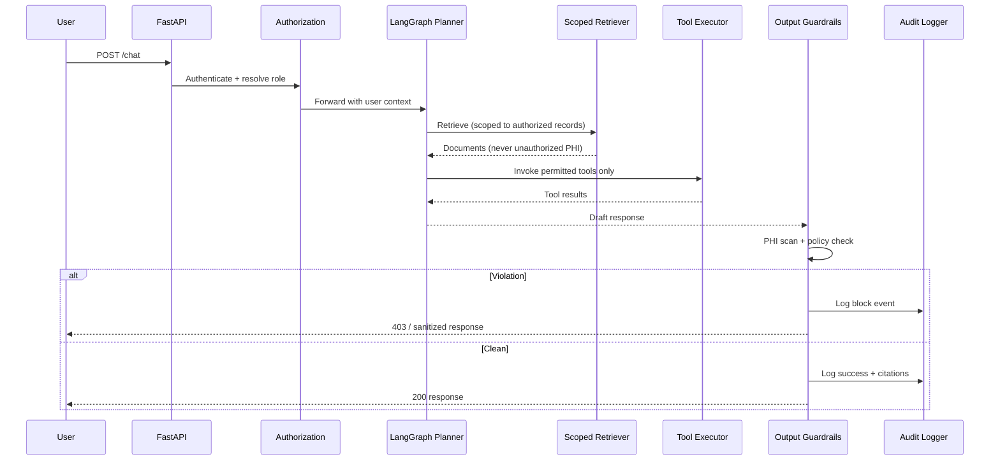

# Runtime Governance Architecture

Governance does not stop at deployment. Every request passes through a **middleware chain** before and after the LangGraph planner.

---

## Request flow



---

## Middleware components

### Authentication

- JWT or API key (demo); pluggable for enterprise IdP
- Resolves `user_id`, `role`, `patient_scope` (for healthcare demo)

### Authorization (RBAC + ABAC)

**Critical architectural principle:** The LLM does not decide who can see PHI.

```
User → Identity → Authorization → Retrieval → LLM
```

If retrieval never returns unauthorized records, the model cannot leak what it never received.

| Role | Can retrieve | Can schedule | Can summarize |
|------|--------------|--------------|---------------|
| `patient` | Own records only | Own appointments | Own visit notes |
| `clinician` | Assigned patients | Assigned patients | Assigned patients |
| `admin` | Audit metadata only | No clinical write | No |

Implementation: `governance/authorization.py`

### Tool permissions

Before any tool invocation:

1. Load agent tool allowlist from harness `sh:Policy`
2. Check user role permissions
3. Deny with audit event if violation

### Output guardrails

Before response returns:

1. Scan for PHI patterns (SSN, MRN, DOB combos)
2. Verify response PHI matches authorized scope
3. Redact or block
4. Escalate to human review queue for high-risk blocks (stub in Phase 4)

Implementation: `governance/output_guardrails.py`

### Audit logger

Structured events:

```json
{
  "event": "governance.block",
  "user_id": "user-123",
  "reason": "unauthorized_patient_access",
  "requested_resource": "patient:john-smith:mri",
  "agent": "healthcare-planner",
  "timestamp": "2026-07-14T12:00:00Z"
}
```

Implementation: `governance/audit.py`

---

## LangGraph placement

LangGraph orchestrates **inside** the governance boundary:

```
┌─────────────────────────────────────────────┐
│  Governance Envelope                        │
│  ┌───────────────────────────────────────┐  │
│  │  LangGraph (implementation detail)    │  │
│  │  - Planner node                       │  │
│  │  - Retrieval node (pre-authorized)    │  │
│  │  - Tool nodes (permission-checked)    │  │
│  └───────────────────────────────────────┘  │
└─────────────────────────────────────────────┘
```

Swapping LangGraph for another orchestrator should not change the governance chain.

---

## Multi-agent layout (Phase 4)

| Agent | Role | Model tier |
|-------|------|------------|
| Planner | Route intent, select tools | Fast |
| Research | Gather context | Fast |
| Retrieval | Execute scoped RAG | Fast |
| Evaluation | Self-check grounding before respond | Frontier |

Maker-checker: Evaluation agent on stronger model validates Planner output before user sees response.

---

## Configuration

Runtime policies merge from:

1. `harness/harness.jsonld` — canonical declaration
2. `governance/policies/runtime.yaml` — environment overrides
3. Environment variables — secrets only

Harness wins on conflict for tool allowlists and invariants.
