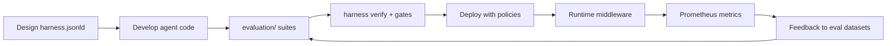

# Semantic Harness Bridge

This repo demonstrates how to **operationalize** a Semantic Harness declaration — turning `sh:Invariant` and `sh:Metric` from documentation into executable CI and runtime controls.

---

## Division of labor

| Concern | semantic-harness | agentic-governance |
|---------|------------------|-------------------|
| Declare agent capabilities | `sh:Agent`, `sh:Tool`, `sh:Skill` | Consumes via `harness/harness.jsonld` |
| Declare policies | `sh:Policy`, `sh:Invariant` | Enforces in middleware + CI |
| Declare metrics | `sh:Metric`, `sh:probe` | CI runs probes; Prometheus exports live metrics |
| Execute agent | semantic-runtimes (reference) | LangGraph (this repo's implementation detail) |
| HDD dev gates | `harness verify`, `hooks install` | CI integrates `harness verify` |

---

## Mapping table

| Harness object | SDLC gate | Runtime enforcement |
|----------------|-----------|---------------------|
| `sh:Invariant` PHI block | `evaluation/phi/` | `output_guardrails.py` |
| `sh:Invariant` grounding | `evaluation/grounding/` | Citation check in guardrails |
| `sh:Metric` hallucination rate | `evaluation/hallucination/` | Prometheus `agent_hallucination_rate` |
| `sh:Metric` latency p95 | `evaluation/latency/` | Prometheus histogram |
| `sh:Metric` token cost | `evaluation/latency/cost.py` | Prometheus counter |
| `sh:Policy` tool allowlist | Architecture validation | `authorization.py` |
| `sh:Goal` goal success | Eval runner | Grafana `agent_goal_success_rate` |

---

## Probe example

Harness metric with CI probe (from `harness/harness.jsonld`):

```json
{
  "@type": "sh:Metric",
  "sh:name": "phi-block-rate",
  "sh:probe": {
    "sh:command": "python -m evaluation.phi --json",
    "sh:parser": "json",
    "sh:valuePath": "$.block_rate",
    "sh:timeoutSeconds": 120
  }
}
```

CI runs `harness verify harness/harness.jsonld` — blocking invariant fails if `block_rate < 1.0`.

---

## Lifecycle alignment



---

## Thought leadership positioning

> **Semantic Harness declares what the agent IS.**  
> **Agentic Governance proves the agent is TRUSTED.**

Together they answer the enterprise architect's question: *"How do we industrialize agentic AI without flying blind?"*

---

## Related repos

- [semantic-harness](https://github.com/leroyjware/semantic-harness) — open standard
- [semantic-runtimes](https://github.com/leroyjware/semantic-runtimes) — HDD CLI + reference executor
- [agentic-governance](.) — this reference architecture
